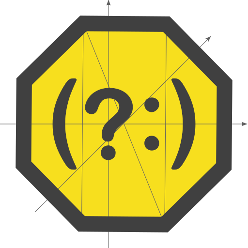

# Rebus

You can...

## ... repackage old rexes

Running:

```js
const old = new RegExp('.*', 'gu');

const re1 = rebus(old);
const re2 = rebus(null, old);
const re3 = rebus();
const re4 = rebus(null, rebus.gany(rebus.C.any));

console.log(old);

console.log(1, re1, '\tis same?', re1 === old);
console.log(2, re2, '\tis same?', re2 === old);
console.log(3, re3, '\tis same?', re3 === old);
console.log(4, re4, '\t\tis same?', re4 === old);

const s = 'asdf';

console.log(1, re1, '\t->', s.match(re1));
console.log(2, re2, '\t->', s.match(re2));
console.log(3, re3, '\t->', s.match(re3));
console.log(4, re4, '\t\t->', s.match(re4));
```

provides:

```bash
/.*/gu
1 /(?:)/gu      is same? false
2 /(?:)/        is same? false
3 /(?:)/        is same? false
4 /.*/          is same? false
1 /(?:)/gu      -> [ '', '', '', '', '' ]
2 /(?:)/        -> [ '', index: 0, input: 'asdf', groups: undefined ]
3 /(?:)/        -> [ '', index: 0, input: 'asdf', groups: undefined ]
4 /.*/          -> [ 'asdf', index: 0, input: 'asdf', groups: undefined ]
```

## ... build long rexes

```js
const {
  F: {none: NONE}, esc: ESC,
  C: {dot: DOT, any, return: RET},
  or, bgn, box, end, gany, nap,
} = rebus;

const SKIP = gany(any);
const SLASH = ESC + '/';

const re = rebus(NONE, or(
  box('npm-debug', DOT, 'log'),
  box(DOT, SKIP, DOT, 'swp'),
  box(DOT, 'DS_Store'),
  box(DOT, 'AppleDouble'),
  box(DOT, 'LSOverride'),
  box('Icon', RET),
  bgn(DOT, '_', SKIP),
  bgn(
    DOT,
    'Spotlight-V100',
    nap(or(
      '$',
      SLASH,
    )),
  ),
  DOT + 'Trashes',
  box('__MACOSX'),
  '~$',
  box('Thumbs', DOT, 'db'),
  box('ehthumbs', DOT, 'db'),
  box('Desktop', DOT, 'ini'),
  end('@eaDir'),
));

console.log(re);

```

results in:
> /^npm-debug\.log$|^\..*\.swp$|^\.DS_Store$|^\.AppleDouble$|^\.LSOverride$|^Icon\r$|^\._.*|^\.Spotlight-V100(?:$|\/)|\.Trashes|^__MACOSX$|~$|^Thumbs\.db$|^ehthumbs\.db$|^Desktop\.ini$|@eaDir$/

## ... use Unicode classes

Code like:

```js
const {F, pup, nup, puv, nuv, U} = rebus;
const {UNICODE: {binary: UB, general: UG, prop: UP}} = rebus;

const s = 'абв (@#?) 123 АБВ αβγ 🙈🙉🙊🐵🐒\0';

const log = (...$$) => {
  const re = rebus(F.global + F.unicode, ...$$);
  console.log(re, s.match(re));
};

log(pup(UG.letter.uppercase));
log(pup(UG.mark));
log(pup(UG.other.control));
log(nuv(UP.general, UG.letter));
log(pup(UB.emoji));
log(puv(UP.script, U.script.cyrl));
log(puv(UP.script, U.script.grek));
```

produces:

```bash
/\p{Lu}/gu [ 'А', 'Б', 'В' ]
/\p{M}/gu null
/\p{Cc}/gu [ '\x00' ]
/\P{gc=L}/gu [
  ' ',  '(',  '@',    '#',
  '?',  ')',  ' ',    '1',
  '2',  '3',  ' ',    ' ',
  ' ',  '🙈', '🙉',   '🙊',
  '🐵', '🐒', '\x00'
]
/\p{Emoji}/gu [
  '#',  '1',  '2',
  '3',  '🙈', '🙉',
  '🙊', '🐵', '🐒'
]
/\p{sc=Cyrillic}/gu [ 'а', 'б', 'в', 'А', 'Б', 'В' ]
/\p{sc=Greek}/gu [ 'α', 'β', 'γ' ]

```

## ... define references for replacement

```js
const {pc, cap, ref, F, C, gsome, gany} = rebus;

const punctuation = gany(pc(C.pspace, '!?,.'));

const re = rebus(
  F.ignore,
  cap(gsome(C.pword)),
  punctuation,
  cap(gsome(C.any)),
  punctuation,
  C.pspace,
  ref(1),
);

console.log(re);
console.log('Run, Barry...'.match(re));
console.log('Run, Barry, run.'.match(re));
console.log('Sir, yes sir!'.replace(re, 'Why, $2'));
```

outputs:

```bash
/(\w+)[\s!?,.]*(.+)[\s!?,.]*\s\1/i
null
[
  'Run, Barry, run',
  'Run',
  'Barry,',
  index: 0,
  input: 'Run, Barry, run.',
  groups: undefined
]
Why, yes!
```
